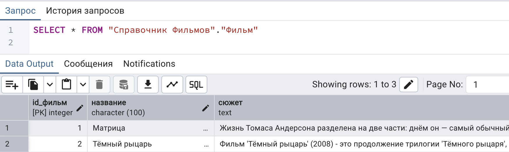
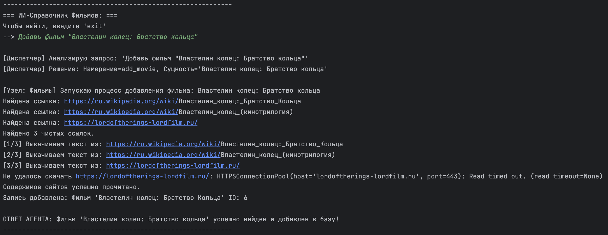
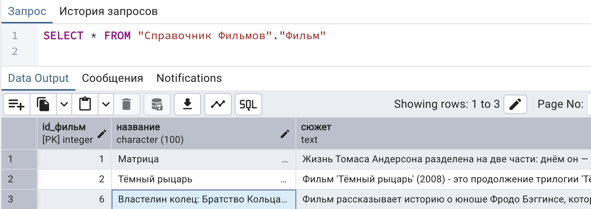

# ИИ-агент для работы с СУБД PostgreSQL

> **Статус проекта:** В разработке

> Read this in [English](README.en.md).

---

## Описание проекта
Данный проект представляет собой программную реализацию автономного ИИ-агента, предназначенного для автоматического поиска, структурирования, модификации и сохранения информации о кинематографе в реляционной базе данных PostgreSQL.

В основе архитектуры системы лежит паттерн **«Маршрутизатор» (Router)**, реализующий концепцию **легковесного состояния (Lean State)**. Разработанный агент в автоматическом режиме определяет намерение пользователя (intent), извлекает именованные сущности, осуществляет асинхронный поиск в открытых источниках (Web Scraping) и выполняет строгую валидацию данных перед их записью в СУБД.

---

## Архитектура и стек технологий

### Компоненты системы:
* **Язык программирования:** Python 3.10+
* **ИИ-фреймворки:** LangChain, LangGraph (`StateGraph`)
* **Валидация данных:** Pydantic v2
* **База данных:** PostgreSQL (драйвер доступа `psycopg2-binary`)
* **Парсинг данных:** DuckDuckGo Search API (`ddgs`), `WebBaseLoader`

---

## Пример работы ИИ-агента

Состояние БД до запроса:



Создание запроса и его обработка:



Состояние БД после запроса:



---

## Инструкция по развертыванию и запуску

### 1. Подготовка базы данных
Перед запуском приложения необходимо развернуть экземпляр СУБД PostgreSQL и инициализировать структуру таблиц. При необходимости следует адаптировать SQL-запросы под целевую схему данных.

### 2. Настройка окружения
В корневой директории проекта необходимо создать файл конфигурации `.env` и определить в нем параметры подключения к базе данных:

```env
DB_PASSWORD=ваш_пароль_от_postgres
```

### 3. Установка зависимостей

Установка требуемых пакетов и библиотек осуществляется через менеджер пакетов `pip`:

```bash
pip install langchain langchain-openai langgraph psycopg2-binary pydantic duckduckgo-search python-doten
```

### 4. Запуск локальной LLM

Для обеспечения работы агента требуется запустить локальную языковую модель через платформу Ollama:

```bash
ollama run название_LLM
```

### 5. Запуск ИИ-агента

После успешного выполнения предыдущих шагов инициализация основного скрипта приложения производится командой:

```bash
python main.py